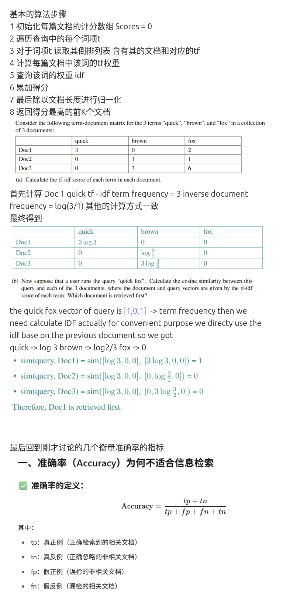

# 倒排索引与检索流程

## 一、问题
当我们想要检索一本书中是否包含某个单词、但是不包含另外一个单词，最简答的做法往往是直接从头到尾阅读这本书的全部内容，然后全部扫描确定。  
这种线性扫描方法被称为 **Grepping**（Linux 上的 `grep` 也直接对应这一功能）。  
对于一个文字不大的书籍这是可行的，但在现实大规模场景中往往不可用。

---

## 二、非线性扫描：关联矩阵
- 建立一个**关联矩阵**：对每个单词建立向量表，记录这个单词在哪些章节/文档中出现。  
  - 用 **1** 表示出现，**0** 表示没有出现。  
  - 然后以**布尔方式**（与 / 或 / 非）操作这些向量。

### 稀疏矩阵与资源开销
- 例如我们拥有 **50 万个词汇**，存在于 **100 万个文档**中 ⇒ **5000 亿**个元素。  
- 由于每个文档只包含 **1000 个单词**，矩阵中 **超过 99.8%** 都是 **0**（极稀疏）。  
- 在实际应用中用处很小，特别是机器学习中完全无法使用。

---

## 三、检索效果指标
1. **准确率 Precision (P)**：被检索到的文档是相关的 / 所有被检索到的文档。  
2. **召回率 Recall**：被检索到的文档是相关的 / 所有相关的文档。

---

## 四、倒排索引（Inverted Index）
现在回到刚才的例子，我们尝试进行优化——引出一个核心概念 **倒排索引**（Inverted Index）。  
其中命名的时候“倒排”这个单词完全没有意义，不知道为什么这样写，但是大佬这样叫我们就这样用了。

**基本思想：记录数据的两个部分**
1. **存在的所有单词** → 使用词汇表/字典记录。  
2. **Postings list**：每个单词对应的文档编号 → 也就是每个次对应的文档编号列表（即这些词出现在哪些文档中）。

### 示例
| Term      | Documents             |
|-----------|-----------------------|
| Brutus    | Doc1, Doc2, Doc4      |
| Caesar    | Doc1, Doc2, Doc4, D5  |
| Calpurnia | Doc2                  |

**查询：** `Brutus AND Caesar AND NOT Calpurnia`  
- 取交集 → `Doc1, Doc2, Doc4` ∩ `Doc1, Doc2, Doc4, D5` = **`Doc1, Doc2, Doc4`**  
- 再排除 Calpurnia 出现的 **Doc2** → **最终结果：`Doc1, Doc4`**

> 看上去很简单，但如果直接用仍然是一个“垃圾方法”（当然能够进行一定优化）。

---

## 五、倒排索引的构建过程
倒排索引是现代搜索引擎的核心结构。

1) **步骤 1：收集文档**  
   `Doc1: Friends, Romans, countrymen. So let it be with Caesar ...`

2) **步骤 2：分词（Token）**  
   将每篇文档转换为一个词条 Token。  
   `Tokens: Friends Romans countrymen So let it be with Caesar`

3) **步骤 3：语言预处理（标准化）**  
   使用之前讲解的方法对语言进行预处理，包括小写化、词干提取、去标点化，使词标准化。  
   `friend roman countryman so let it be with caesar`

4) **步骤 4：构建倒排索引**  
   从标准化的 Tokens 中建立倒排索引。


# 倒排索引：Postings、DF、TF、BOW 与 IDF（排版版）

## 一、Postings 与 DF 基本概念
- **Posting** 标识其在哪些文档中出现过。  
- 随后将 **Posting** 出现的**次数**进行统计，最终合并成为 **一个倒排索引**（Inverted Index）。

### 示例表
| Term       | Document Frequency | Postings List |
|------------|--------------------|---------------|
| ambitious  | 1                  | 2             |
| be         | 1                  | 2             |
| brutus     | 2                  | 1, 2          |
| caesar     | 2                  | 1, 2          |

- **DF（Document Frequency）**：标识该词出现在多少**不同**的文档中。  
- **Posting**：表示**出现的文档**是哪些。

---

## 二、在倒排上的优化：引入词频（TF）
我们过去单纯统计**哪些文档中出现过该词**。现在我们加入**某个词在某个文档出现的次数**，记为：  
- **TF (Term Frequency)**：`tf(t, d)`

在统计的时候，采用 **Bag-of-Words（BOW）** 方法：**忽略顺序**，只考虑词出现的**次数**。

### BOW 等价示例
- “Mary is quicker than John”  
- “John is quicker than Mary”  
在 **BOW** 模型中二者**相同**，因为它们的**词频统计完全一致**。

---

## 三、基于词频（TF）的评分机制
将文档中**出现的词的次数**作为它在文档中的**权重**，据此对用户查询词与文档之间进行加权匹配并进行**排序**：

```
Score(d, q) = ∑ tf(t, d)
```

---

## 四、问题：高频词的干扰
仅靠 TF 会出现问题：诸如 **a / the / is** 等**高频词**几乎所有文档都出现，但它们**区分度差**，容易主导打分。

---

## 五、引入 IDF（逆文档频率）
为降低常见词的重要性、提升稀有词的区分能力，我们引入：  
- **IDF (Inverse Document Frequency)**：**减弱**出现频率过高的词的权重，**提高**稀有词的区分能力。

> （在实际系统中，常与 TF 结合为 **TF‑IDF** 用于排序。）
> 
> 这样我们直接让一些很少出现的词汇的idf变的非常大
最后我们将tf 和idf结合 生成 tf-idf 这样我们就能够在输入的时候考量 一个词在某篇文档出现来很多次 TF高 且这个词在语料库很少见 IDF高

